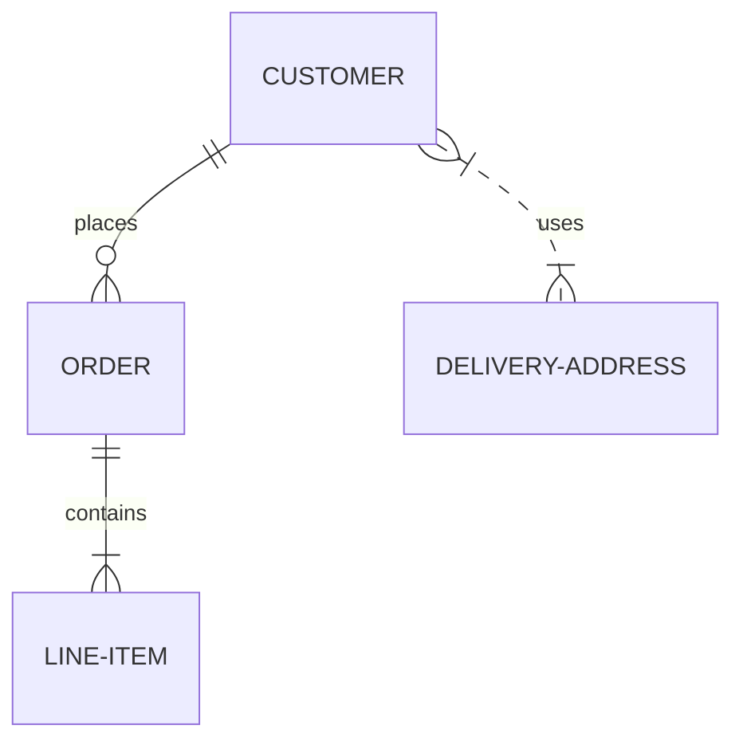

# Address Book API in FastAPI (Python)

The purpose of this repository is to get my hands dirty with FastAPI skills. It would demonstrate various common operations which you perform for any API using FastAPI like Database connections, File uploads, Authentication, Sessions and More.

## Models 

## Resources

Following resources were used for motivation in designing this template

- [Fast API Official Website](https://fastapi.tiangolo.com/)
- [Udemy Course - FastAPI](https://www.udemy.com/course/fastapi-the-complete-course/)

## Authors

* **Amit Prafulla (APFirebolt)** - [My Website](https://apgiiit.com)

## License

This project is licensed under the MIT License - see the [LICENSE.md](LICENSE.md) file for details

