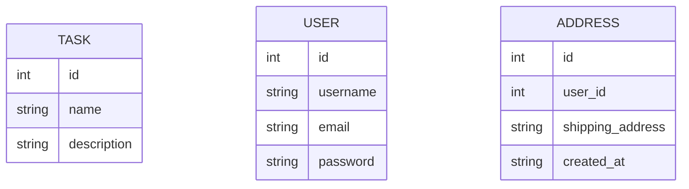

# Address Book API in FastAPI (Python)

The purpose of this repository is to get my hands dirty with FastAPI skills. It would demonstrate various common operations which you perform for any API using FastAPI like Database connections, File uploads, Authentication, Sessions and More.

# Why Fast API ?

FastAPI is a modern back-end framework written in Python which can be used as an alternative to other popular Python based frameworks available like Django and Flask.

### Reasons you might want to use Fast API:

Fast: Very high performance, on par with NodeJS and Go (thanks to Starlette and Pydantic). One of the fastest Python frameworks available.

Fast to code: Increase the speed to develop features by about 200% to 300%.

Fewer bugs: Reduce about 40% of human (developer) induced errors.

Intuitive: Great editor support. Completion everywhere. Less time debugging.

Easy: Designed to be easy to use and learn. Less time reading docs.

Short: Minimize code duplication. Multiple features from each parameter declaration. Fewer bugs.

Robust: Get production-ready code. With automatic interactive documentation.

Standards-based: Based on (and fully compatible with) the open standards for APIs: OpenAPI (previously known as Swagger) and JSON Schema.

## Models

At the time of writing this, the API has three models which would be Task, User and Address. Task model is totally unrestricted, anyone can perform CRUD operations on it. User module is for authentication which is token based. Authenticated users can add address and perform CRUD on it. Object level filtering has been applied which would restrict users to perform CRUD operations on addresses which were not created by them. 

## Resources

Following resources were used for motivation in designing this template

- [Fast API Official Website](https://fastapi.tiangolo.com/)
- [Udemy Course - FastAPI](https://www.udemy.com/course/fastapi-the-complete-course/)

## Authors

* **Amit Prafulla (APFirebolt)** - [My Website](https://apgiiit.com)

## License

This project is licensed under the MIT License - see the [LICENSE.md](LICENSE.md) file for details

